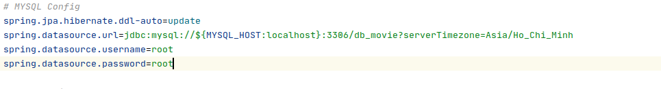

# Movie-Tickets

## Trang web bán vé xem phim
Đề tài: Xây dựng trang web bán vé xem phim.

Trang web được xây dựng trên Spring Boot và MYSQL. 

### Điều kiện
> - Java 11
> - MYSQL 8.0

### Cách cài đặt
- Thay đổi username, password và port trong file [application.properties](./src/main/resources/application.properties)

- Tạo database tên là `db_movie` trong MYSQL

> CREATE DATABASE db_movie;
>
> USE db_movie;

- Chạy file [data.sql](./sql/data.sql) để tạo dữ liệu
- Chạy project

> mvnw spring-boot:run
>
> mvn spring-boot:run (Nếu máy bạn đã cài đặt maven)

- Truy cập http://localhost:8080
